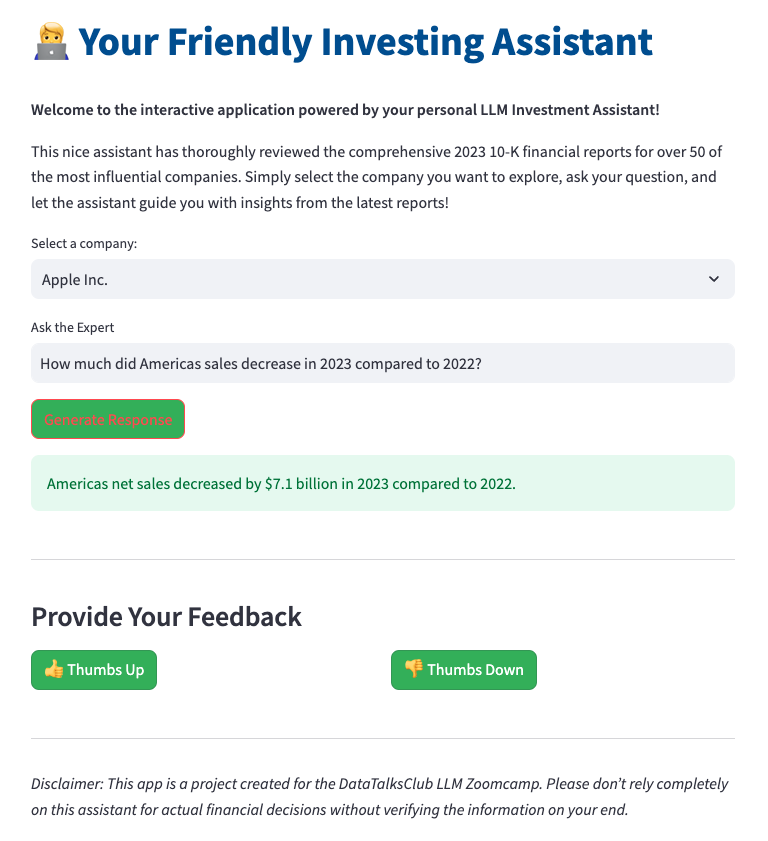
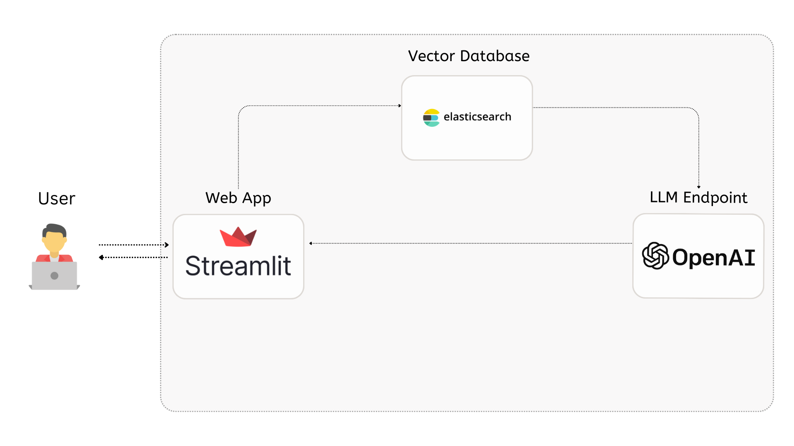

# Investment Assistant


# Problem Description

Investors and traders often face challenges when analyzing 10-K reports from large companies due to their length and complexity. These reports are packed with detailed financial statements, risk disclosures, management discussion and analysis (MD&A), making it difficult to quickly extract relevant insights. For casual investors, understanding financial jargon and metrics can be overwhelming, while experienced investors struggle with the time-consuming process of analyzing multiple reports. The critical information, such as key risks or growth opportunities, is often buried deep within the documents, and the need to act fast on new data makes the process even more daunting.

# Investor Assistant

The Investment Assistant is an LLM-powered QA RAG system that breaks 2023 10-K financial reports from 60+ large companies into meaningful chunks, addresses these challenges by allowing users to interact with the reports in real time. This enables quick retrieval of key insights, simplifies complex financial data, and provides accurate, context-aware responses to specific queries. By offering immediate access to critical financial information, risks, and opportunities, the tool empowers investors to make informed decisions and act swiftly on newly released data, staying ahead of market movements.




# RAG Architecture



# Technology Stack

- Python 3.9
- Streamlit: For the Application
- Elasticsearch: For hybrid Search
- OpenAI: For the LLM 
- Docker: Initialization of Elastic Search service

# Dataset
This dataset contain information in a Question Answering (QA) format from a diversified portofolio of well-known large companies with creat influence in their information.
- This QA records were created using the 2023-10-K annual financial reports.
- The selected dataset is a publicly available dataset hosted on Hugging Face Datasets page.
- You can find the dataset here: [asset-investment-financial-dataset](https://huggingface.co/datasets/shashankyadav03/asset-investment-financial-dataset)

# Code
For this project the following scripts were created to desigh and optimize the RAG system
1. [Dataset_Exploration_Analysis.ipynb](data/Dataset_Exploration_Analysis.ipynb) - for the initial explorational analysis and cleaing of the dataset
2. [ground_truth_generation.ipynb](retrieval_evaluation/ground_truth_generation.ipynb) - for generating 5 user queries of each record of a sample of the dataset
3. [retrieval_methods_evaluation.ipynb](retrieval_evaluation/retrieval_methods_evaluation.ipynb) - To evaluate different retrieval methods

For keyword search we tried different boostings for the text fields in the record. The results denote that no specific field shoulb be boostin
| question_boost | answer_boost | context_boost | hit_rate | mrr   |
|----------------|--------------|---------------|----------|-------|
| 1              | 1            | 1             | 88.58    | 78.01 |
| 2              | 1            | 1             | 85.93    | 74.03 |
| 3              | 1            | 1             | 84.21    | 72.01 |
| 1              | 2            | 1             | 81.14    | 66.77 |
| 1              | 3            | 1             | 72.7     | 58.75 |
| 1              | 1            | 2             | 85.04    | 70.7  |
| 1              | 1            | 3             | 83.46    | 69.4  |

For vector search we tried different embedding combining different text fields in the record. The results denote that including both question, answer and context in the embeddings gives the best results
| field                     | hit_rate | mrr   |
|----------------------------|----------|-------|
| question_vector            | 86.42    | 74.4  |
| answer_vector              | 63.92    | 54.51 |
| context_vector             | 82.34    | 67.96 |
| question_answer_vector     | 86.86    | 75.48 |
| answer_context_vector      | 84.62    | 72.39 |
| question_context_vector    | 87.65    | 76.79 |
| question_answer_context_vector | 88.04 | 76.64 |

Then for the hybrid search we saw that 0.75 of the total search score should be derived from vector search and only 0.25 from keyword search.
| vector_boosting | keyword_boosting | hit_rate | mrr   |
|-----------------|------------------|----------|-------|
| 1.0             | 0.0              | 88.04    | 76.64 |
| 0.75            | 0.25             | 90.59    | 79.97 |
| 0.5             | 0.5              | 89.49    | 78.86 |
| 0.25            | 0.75             | 88.77    | 78.41 |
| 0.0             | 1.0              | 88.58    | 78.01 |

So from this analysis we will use hybrid search with score = 0.75 x vector_search + 0.25 x keyword search

4. [rag_method_evaluation.ipynb](rag_evaluation/rag_method_evaluation.ipynb.ipynb) - To evaluate different models with the results

Besed on the results we concluded we should use the gpt-3.5-turbo because it has better results in a smaller cost
| Statistic | GPT-3.5-Turbo   | GPT-4o-Mini    |
|-----------|-----------------|----------------|
| count     | 5175.000000     | 5175.000000    |
| mean      | 0.675053        | 0.667464       |
| std       | 0.260706        | 0.254250       |
| min       | -0.142951       | -0.144704      |
| 25%       | 0.458635        | 0.459455       |
| 50%       | 0.728625        | 0.719755       |
| 75%       | 0.906797        | 0.890118       |
| max       | 1.000000        | 1.000000       |

5. Lastly, after this analysis we create all the utilities of the application in the below files
- [db_prep.py](investment_assistant/db_prep.py) - with the initialization and indexing of QA data
- [assistant.py](investment_assistant/assistant.py) - with the optimized rag system
- [app.py](investment_assistant/app.py) - with the Streamlit application

# Running the Application
To run the application you need to follow the below steps:

1. Install the dependencies for the project
```bash
pip intall requirements.txt
```
2. Set up your openAI API key into an environmental variable

Copy .envrc_template into .envrc and insert your key there. - the .envrc will be picked up by the .gitignore file

3. Run the docker-compose file to initialize all the services used in the application - such as elastic search
```bash
docker-compose up --build
```
4. Then connect to the application's folder
```bash
cd investment_assistant
```
5. Run this command to fetch all files in the elastic search index
```bash
python db_prep.py
```
6. Run the streamlit application
```bash
streamlit run app.py
```
7. Access the application from http://localhost:8501

